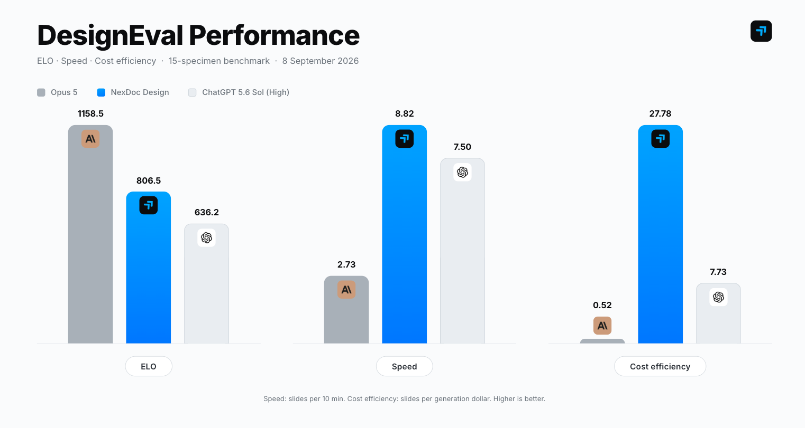

# NexDoc Design MCP - Give your agent design superpowers

[Model Context Protocol](https://modelcontextprotocol.io) server for [NexDoc Design](https://www.nexdoc.design) — generate, update, export, and publish production-ready designs from Claude, ChatGPT, Cursor, and other MCP clients.

**Source for this package lives in a private monorepo.** This public repo is the registry / docs surface. Install from npm or connect to the hosted endpoint below.

## DesignEval results

On the open [DesignEval](https://github.com/nexdocai/nxd-design-evals) 15-specimen benchmark (8 Sep 2026), NexDoc Design leads on speed and cost while staying competitive on visual quality:



| System | ELO | Speed (slides / 10 min) | Cost efficiency (slides / $) |
|--------|-----|-------------------------|------------------------------|
| **NexDoc Design** | 806.5 | **8.82 (best)** | **27.78 (best)** |
| Opus 5 | **1158.5 (best)** | 2.73 | 0.52 |
| ChatGPT 5.6 Sol (High) | 636.2 | 7.50 | 7.73 |

- **3.2× faster** than Opus 5 (8.8 vs 2.73 slides every 10 minutes)
- **53× more cost-efficient** than Opus 5 (27.8 vs 0.52 slides per generation dollar)
- Blind pairwise judging across four frontier multimodal judges; raw battles, prompts, and PNGs are in [`nexdocai/nxd-design-evals`](https://github.com/nexdocai/nxd-design-evals)

## Quick start (recommended)

### Remote HTTP + OAuth (ChatGPT, Claude, Cursor)

Add this MCP URL and complete the browser login. Do **not** paste an API key.

```
https://mcp.nexdoc.design/mcp
```

If a client offers **OAuth** vs **Token / API key**, choose **OAuth**.

### Local stdio (API key)

```json
{
  "mcpServers": {
    "nexdoc": {
      "command": "npx",
      "args": ["-y", "@nexdoc/mcp-server"],
      "env": {
        "NXD_API_KEY": "nxd_live_...",
        "NXD_API_URL": "https://api.nexdoc.design"
      }
    }
  }
}
```

Create an API key in your NexDoc account settings. Package: [`@nexdoc/mcp-server`](https://www.npmjs.com/package/@nexdoc/mcp-server).

## Tools

| Tool | Purpose |
|------|---------|
| `create_design` | Create/reuse a job and start a run |
| `update_design` | New run with edit instructions |
| `request_file_upload` | Presigned URL for a photo/logo (PUT original bytes, then pass `file_ids`) |
| `check_file` | Confirm an uploaded file is `ready` |
| `upload_file` | stdio only: read a local path and upload |
| `check_run` | One-shot status (fresh `viewer_url`) |
| `refresh_preview` | New preview link if the old one expired |
| `wait_for_run` | Short poll after create/update (default ~45s). Do not loop |
| `notify_run_email` | Email when the run finishes |
| `list_runs` | Runs for a job |
| `export_design` | `pdf`, `html`, or `png` → download URL |
| `publish_design` / `unpublish_design` | Public URL — only when the user asks |
| `list_formats` | Format catalog |
| `get_balance` | Wallet summary |

## Example prompt

> Create a business card for Jane Doe, Founder at Acme. Dark minimal layout. Give me the job id as soon as it starts, then the viewer URL and a PDF when it is ready.

## Links

- Product: [nexdoc.design](https://www.nexdoc.design)
- npm: [`@nexdoc/mcp-server`](https://www.npmjs.com/package/@nexdoc/mcp-server)
- Hosted MCP: [mcp.nexdoc.design/mcp](https://mcp.nexdoc.design/mcp)
- DesignEval: [nexdocai/nxd-design-evals](https://github.com/nexdocai/nxd-design-evals)

## License

MIT
